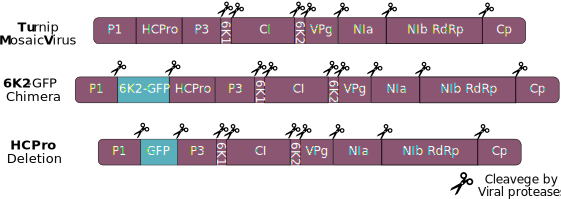

<!-- VirusSilencing  Folder -->

```{r, include=FALSE}
#options(scipen=999) ; options(scipen=0)
library(ggplot2, quietly = F)
library(plyr, quietly = F)
library(ggplot2, quietly = F)
library(ggpubr, quietly = F)
library(ggrepel, quietly = T)


mgsub <- function(pattern, replacement, x, ...) {
  if (length(pattern)!=length(replacement)) {
    stop("pattern and replacement do not have the same length.")
  }
  result <- x
  for (i in 1:length(pattern)) {
    result <- gsub(fixed = T,pattern[i], replacement[i], result, ...)
  }
  result
}
```

# Introduction

Plant viruses occur globally and have a profound impact on plant evolution, population structure, and agricultural practices. As obligate biotrophs, these intracellular nanorganisms depend entirely on their host's survival to complete their replication cycle, propagate, and disperse. In response, plants have evolved an array of defenses to counteract viral infection, often leading to a trade-off between growth and defense. This trade-off is central to plant-virus interactions, as mounting a defense response frequently comes at the cost of reduced growth and reproduction @karasov2017mechanisms. Understanding how plants prioritize growth or defense in viral infection context is essential to developing effective crop protection methods, making it a pressing issue in agricultural research.

In this laboratory practice, we will investigate how variations in viral genetics lead to a differential impact on plant growth and defense trade-off using the compatible *Nicotiana benthamiana* / *Turnip Mosaic Virus* pathosystem.

Nicotiana benthamiana, a species susceptible to a wide range of viruses, serves as an important model organism for research in molecular plant sciences and genetics. The single-stranded RNA virus Turnip Mosaic Virus (**TuMV**) is a widespread plant pathogen known to infect a broad range of host species, causing significant agricultural losses. Today We will infect N. benthamiana plants with two TuMV constructs: TuMV-6K2-GFP (**6K2G**) and TuMV-ΔHCPro expressing free GFP (**ΔHCG**) to evaluate the growth-defense trade-off. These constructs allow us to assess how specific viral proteins influence the growth and defense balance. By infecting individual plants with each construct and with a mix of both constructs, we aim to determine which virus and growth effects prevail under mixed infections. As a negative control, plants will be infiltrated with Agrobacterium expressing free GFP to account for agroinfiltration effects.

The two viral constructs of our growth impact contest are:

-   TuMV "6K2-GFP" (6K2G) construct developed by @thivierge2008eukaryotic

-   TuMV "ΔHCPro" expressing free GFP (ΔHCG) construct developed by @hafren2018turnip

<div style="text-align: center;">
<figure>

<figcaption style="margin-top: 10px;"><strong>Polyprotein structure of three viral constructs of TuMV</strong>. On top, Wild type configuration of TuMV genome. 6K2G construct expresses an additional copy of the membrane-associated 6K2 protein with a GFP attached to its C-terminal region. HCPro deletion or ΔHCPro construct expresses a cleavable free GFP instead of the viral protease HC. 
</figcaption>
</figure>
<a name="Polyprotein"></a>
</div>

We will then determine disease symptoms by evaluating at 15 days post-infection the degree of GFP expression using a UV torch in plant leaves and quantifying viral accumulation to compare these traits between the two viral strains as well with the combinatory treatment exploring the relationships between TuMV genetics and their growth impact on N. benthamiana

# Results 

## Relative fresh weight 

```{r, warning=FALSE, error=FALSE}
  TuMV_FW <- read.csv("Data/BI1293_FW_Relative.csv", sep = ",", header = T)
  TuMV_FW$Construct <- factor(TuMV_FW$Construct, levels = c("Mock","GFP", "Hcpro","6K2", "HCproX6K2"))
  
# Average per contruct
  average_weights <- ddply(TuMV_FW, .(Construct), summarize, Avg_Weight = mean(FW.g.))  
    average_weights_control <- subset(average_weights, Construct == "Mock")
# Relative weigth to GFP average
  TuMV_FW$Relative_Weight <- TuMV_FW$FW.g. / average_weights_control$Avg_Weight
  
  colors <- c( "6K2" = "#67001F",  "HCproX6K2" = "#CE1256", "Hcpro" = "#DF65B0" , "GFP" = "#C994C7", "Mock" = "black")

# Plot
  TuMV_FW_plot <- ggplot(TuMV_FW, aes(x=Construct, y=Relative_Weight,fill = Construct)) +
     geom_bar(position = position_dodge(width = 0.9), stat = 'summary' ) +
  geom_errorbar(position = position_dodge(width = 0.9),stat = 'summary', width = 0.4,alpha = 0.5) + 
  geom_jitter( stat = 'identity', shape = 16, position = position_jitterdodge(0.15), size = 0.8, alpha = 0.5, color = "grey20") +
  labs(title = "Disease severity in fresh weight loss of 15dpi Plants", y = "Relative Fresh weight (mg)", x = "Agroinfiltration construct" ) +
   scale_fill_manual(values = colors) +  theme_classic(base_size = 14) +
theme(axis.text.x = element_text(angle = 90), legend.position = "bottom", plot.title = element_text(hjust = 0.5))

# Adding signifance test
comparisons <- list(
c( "Mock", "Hcpro"),
c("Mock","GFP"),
c( "Mock","6K2"),
c("Mock","HCproX6K2"),
c("6K2","HCproX6K2"))

TuMV_FW_plot_sig <-   TuMV_FW_plot +   stat_compare_means(comparisons = comparisons,  method = "t.test", label = "p.signif")
TuMV_FW_plot_sig

ggsave(device = svg, "Results/FreshWeight_TuMV.svg", plot = TuMV_FW_plot_sig,  width=8, height=6)
```
Why is the lab called [Sociovirology](https://www.quantamagazine.org/viruses-finally-reveal-their-complex-social-life-20240411/) ?

## GFP and Viral titers preliminar analysis 

```{r, warning=FALSE, error=FALSE}
qPCRs_raw <-  read.table( "Data/Nb_TuMV_GFP_CP_6K2.csv", sep = ",", header = T)
qPCRs_fil <- qPCRs_raw[qPCRs_raw$Cq != "N/A",] 
qPCRs_fil$Cq <- as.numeric(qPCRs_fil$Cq)
qPCRs_fil_avg <- ddply(qPCRs_fil, .(Primer, Genotype,Replicate), summarize, Avg_Ct = mean(Cq) )
qPCRs_PP2A <- qPCRs_fil_avg[qPCRs_fil_avg$Primer =="PP2A",]
qPCRs_Target <- qPCRs_fil_avg[qPCRs_fil_avg$Primer !="PP2A",]

qPCRs_DCt <- merge(x = qPCRs_PP2A , y = qPCRs_Target, by =c("Genotype","Replicate"))
qPCRs_DCt$DCt <- qPCRs_DCt$Avg_Ct.y - qPCRs_DCt$Avg_Ct.x                    

qPCRs_DCt$log2DDCt <- 2^-( qPCRs_DCt$DCt )

qPCRs_DCt$Primer.y <- factor(qPCRs_DCt$Primer.y , levels = c("GFP","6K2-GFP","TuMV CP"))
 TuMV_titters <- ggplot(qPCRs_DCt, aes(x = Genotype, y = log2DDCt, fill = Genotype , group =  Genotype)) +
     geom_bar(position = position_dodge(width = 0.9), stat = 'summary', fun.data = mean_se, alpha = 0.6) +
geom_errorbar(position = position_dodge(width = 0.9),
                stat = 'summary', fun.data = mean_se, width = 0.4) + facet_wrap(~ Primer.y , scales = "free")  + 
   ylab("Relative expression to PP2A")   +  xlab("Gene expressed") +
   geom_point(position = position_dodge(width = 0.9), alpha = 0.5, size = 0.8, color = "grey20" ) + theme_classic(base_size = 14) +
   theme(axis.text.x = element_text(angle = 90,size = 14)) 
 TuMV_titters
```

## Lab practice 2024: GFP and Viral titers 

```{r, warning=FALSE, error=FALSE}
qPCRs_raw <-  read.table( "Data/All_Results.csv", sep = "\t", header = T)
  
qPCRs_fil_avg <- ddply(qPCRs_raw, .(Primer, Construct,Sample_Group), summarize, Avg_Ct = mean(CQ), Sd_Ct = sd(CQ)  )

qPCRs_avg_sd <- merge(qPCRs_raw,qPCRs_fil_avg, by =c("Primer","Construct","Sample_Group") )

write.csv(qPCRs_fil_avg, "Results/qPCRs_avg_sd")
qPCRs_PP2A <- qPCRs_fil_avg[qPCRs_fil_avg$Primer =="PP2A",]

PP2A_CQ<- ggplot(qPCRs_PP2A, aes(x = Sample_Group, y = Avg_Ct, fill = Construct , group =  Construct)) +
     geom_bar(position = position_dodge(width = 0.9), stat = 'summary', fun.data = mean_se, alpha = 0.6) +
geom_errorbar(position = position_dodge(width = 0.9),
                stat = 'summary', fun.data = mean_se, width = 0.4) + facet_wrap(~ Construct , scales = "free") + geom_point(position = position_dodge(width = 0.9), alpha = 0.5, size = 0.8, color = "grey20" ) + theme_classic(base_size = 14) 
PP2A_CQ
ggsave(device = svg, "Results/PP2A_CQ.svg", plot = PP2A_CQ,  width=10, height=6)
qPCRs_avg_sd_fil <- qPCRs_avg_sd[!grepl("6K2_ERV|HX6_FEM|HX6_5",qPCRs_avg_sd$Sample_Group),]
qPCRs_PP2A_fil <- qPCRs_avg_sd_fil[qPCRs_avg_sd_fil$Primer =="PP2A",]
PP2A_CQ_fil <-ggplot(qPCRs_PP2A_fil, aes(x = Sample_Group, y = Avg_Ct, fill = Construct , group =  Construct)) +
     geom_bar(position = position_dodge(width = 0.9), stat = 'summary', fun.data = mean_se, alpha = 0.6) +
geom_errorbar(position = position_dodge(width = 0.9),
                stat = 'summary', fun.data = mean_se, width = 0.4) + facet_wrap(~ Construct , scales = "free") + geom_point(position = position_dodge(width = 0.9), alpha = 0.5, size = 0.8, color = "grey20" ) + theme_classic(base_size = 14) 
PP2A_CQ_fil
ggsave(device = svg, "Results/PP2A_CQ_fil.svg", plot = PP2A_CQ_fil,  width=10, height=6)

qPCRs_Target <- qPCRs_avg_sd_fil[qPCRs_avg_sd_fil$Primer !="PP2A",]

qPCRs_Target_CQ<- ggplot(qPCRs_Target, aes(x = Sample_Group, y = Avg_Ct, fill = Construct , group =  Construct)) +
     geom_bar(position = position_dodge(width = 0.9), stat = 'summary', fun.data = mean_se, alpha = 0.6) +
geom_errorbar(position = position_dodge(width = 0.9),
                stat = 'summary', fun.data = mean_se, width = 0.4) + facet_wrap(~ Construct , scales = "free") 
  ggsave(device = svg, "Results/qPCRs_Target_CQ.svg", plot = qPCRs_Target_CQ,  width=10, height=6)

qPCRs_fil_avg <- qPCRs_fil_avg[!grepl("6K2_ERV|HX6_FEM|HX6_5",qPCRs_fil_avg$Sample_Group),]
write.csv(qPCRs_fil_avg, "Results/qPCRs_avg_sd_filtered.csv")


qPCRs_fil_PP2A <- qPCRs_fil_avg[qPCRs_fil_avg$Primer =="PP2A",]
qPCRs_fil_Target <-  qPCRs_fil_avg[qPCRs_fil_avg$Primer !="PP2A",]

qPCRs_DCt <- merge(x = qPCRs_fil_PP2A , y = qPCRs_fil_Target, by =c("Construct","Sample_Group"))

qPCRs_DCt$DCt <- qPCRs_DCt$Avg_Ct.y - qPCRs_DCt$Avg_Ct.x                    

qPCRs_DCt$RelExpr <- 2^-( qPCRs_DCt$DCt )

qPCRs_DCt$Primer.y  <- mgsub(pattern = c("6K2","CP"), replacement = c("6K2-GFP","TuMV-CP"), x = qPCRs_DCt$Primer.y )
qPCRs_DCt$Construct <- gsub(pattern = "HX6", "6K2xDHC", qPCRs_DCt$Construct)

qPCRs_DCt$Construct <- factor(qPCRs_DCt$Construct , levels = c("GFP","HCPro","6K2","6K2xDHC"))
qPCRs_DCt$Primer.y <- factor(qPCRs_DCt$Primer.y , levels = c("GFP","6K2-GFP","TuMV-CP"))

  
  TuMV_RE_NoCP <- ggplot(qPCRs_DCt[qPCRs_DCt$Primer.y != "TuMV-CP",], aes(x = Construct, y = RelExpr, fill = Construct , group =  Construct)) +
     geom_bar(position = position_dodge(width = 0.9), stat = 'summary', fun.data = mean_se, alpha = 0.6) +
geom_errorbar(position = position_dodge(width = 0.9),
                stat = 'summary', fun.data = mean_se, width = 0.4) + facet_wrap(~ Primer.y , scales = "free")  +    ylab("Relative expression to PP2A")   +  xlab("Plant agroinfiltrated") +
   geom_text_repel( color ="red",
             aes(label = Sample_Group,  hjust = -0.05, vjust = -0.05)) +
   geom_point(position = position_dodge(width = 0.9), alpha = 0.5, size = 0.8, color = "grey20" ) + theme_classic(base_size = 14) +
   theme(axis.text.x = element_text(angle = 90,size = 14), legend.title = element_blank(),legend.position = "none") 
    ggsave(device = svg, "Results/TuMV_RE_NoCP.svg", plot = TuMV_RE_NoCP,  width=10, height=6)
  TuMV_RE_NoCP
  
  
  TuMV_RE_CP <- ggplot(qPCRs_DCt[qPCRs_DCt$Primer.y == "TuMV-CP",], aes(x = Construct, y = log2(RelExpr), fill = Construct , group =  Construct)) +
     geom_bar(position = position_dodge(width = 0.9), stat = 'summary', fun.data = mean_se, alpha = 0.6) +
geom_errorbar(position = position_dodge(width = 0.9),
                stat = 'summary', fun.data = mean_se, width = 0.4) + facet_wrap(~ Primer.y , scales = "free")  +    ylab("Relative expression to PP2A")   +  xlab("Plant agroinfiltrated") +
   geom_text_repel( color ="red",
             aes(label = Sample_Group,  hjust = -0.05, vjust = -0.05)) +
   geom_point(position = position_dodge(width = 0.9), alpha = 0.5, size = 0.8, color = "grey20" ) + theme_classic(base_size = 14) +
   theme(axis.text.x = element_text(angle = 90,size = 14), legend.title = element_blank(),legend.position = "none") 
ggsave(device = svg, "Results/TuMV_RE_CP.svg", plot = TuMV_RE_CP,  width=10, height=6)
TuMV_RE_CP
```

<!--
## Delta delta Cq using GFP as reference
```{r, warning=FALSE, error=FALSE}

 qPCRs_DCt_Ctrl <-  ddply(qPCRs_DCt[qPCRs_DCt$Primer.y == "GFP",], .(Sample_Group,Primer.y), summarize, Avg_DCt = mean(DCt) )
qPCRs_DDCt <-  merge(qPCRs_DCt, qPCRs_DCt_Ctrl,  by = c( "Sample_Group"))
qPCRs_DDCt$log2DDCt <- 2^-(qPCRs_DDCt$DCt -qPCRs_DDCt$Avg_DCt)
#factor(qPCRs_DDCt$Sample_Group )
#  ggplot(qPCRs_DDCt[qPCRs_DDCt$Sample_Group != "6K2_5" & qPCRs_DDCt$Sample_Group != "6K2_4",], 

#ggplot(qPCRs_DDCt[!grepl("TA", qPCRs_DDCt$Sample_Group ),], 
       
#ggplot(qPCRs_DDCt[grepl("_TA", qPCRs_DDCt$Sample_Group ),], 
qPCRs_DDCt_plot <- ggplot(qPCRs_DDCt[qPCRs_DDCt$Primer.y.x == "TuMV-CP",],       aes(x = Construct, y =log2(log2DDCt), fill = Construct , group =  Construct)) +
     geom_bar(position = position_dodge(width = 0.9), stat = 'summary', fun.data = mean_se, alpha = 0.6) +
geom_errorbar(position = position_dodge(width = 0.9),
                stat = 'summary', fun.data = mean_se, width = 0.4) + facet_wrap(~ Primer.y.x , scales = "free")  + 
   ylab("Log2 Relative expression to GFP")   +  xlab("Construct") +
     geom_text_repel( color ="red",
             aes(label = Sample_Group,  hjust = -0.05, vjust = -0.05)) +
   geom_point(position = position_dodge(width = 0.9), alpha = 0.5, size = 0.8, color = "grey20" ) + theme_classic(base_size = 14) +
   theme(axis.text.x = element_text(angle = 90,size = 14)) 


qPCRs_DDCt_plot_others <- ggplot(qPCRs_DDCt[qPCRs_DDCt$Primer.y.x != "TuMV-CP",],       aes(x = Construct, y =log2DDCt, fill = Construct , group =  Construct)) +
     geom_bar(position = position_dodge(width = 0.9), stat = 'summary', fun.data = mean_se, alpha = 0.6) +
geom_errorbar(position = position_dodge(width = 0.9),
                stat = 'summary', fun.data = mean_se, width = 0.4) + facet_wrap(~ Primer.y.x , scales = "free")  + 
   ylab("Relative expression to GFP")   +  xlab("Construct") +
     geom_text_repel( color ="red",
             aes(label = Sample_Group,  hjust = -0.05, vjust = -0.05)) +
   geom_point(position = position_dodge(width = 0.9), alpha = 0.5, size = 0.8, color = "grey20" ) + theme_classic(base_size = 14) +
   theme(axis.text.x = element_text(angle = 90,size = 14)) 
qPCRs_DDCt_plot

ggsave(device = svg, "Results/qPCRs_DDCt_plot.svg", plot = qPCRs_DDCt_plot,  width=10, height=6)
ggsave(device = svg, "Results/qPCRs_DDCt_others_plot.svg", plot = qPCRs_DDCt_plot_others,  width=10, height=6)

```

-->

## Which virus prevailed in the contest ?
```{r, warning=FALSE, error=FALSE}
TuMV_RE_CP <- ggplot(qPCRs_DCt[qPCRs_DCt$Primer.y == "TuMV-CP",], aes(x = Construct, y = log2(RelExpr), fill = Construct , group =  Construct)) +
     geom_bar(position = position_dodge(width = 0.9), stat = 'summary', fun.data = mean_se, alpha = 0.6) +
geom_errorbar(position = position_dodge(width = 0.9),
                stat = 'summary', fun.data = mean_se, width = 0.4) + facet_wrap(~ Primer.y , scales = "free")  +    ylab("Log2 Relative expression to PP2A")   +  xlab("Plant agroinfiltrated") +
   geom_point(position = position_dodge(width = 0.9), alpha = 0.5, size = 0.8, color = "grey20" ) + theme_classic(base_size = 14) +
   theme(axis.text.x = element_text(angle = 90,size = 14), legend.title = element_blank(),legend.position = "none") 

comparisons <- list(
c("GFP","HCPro"),
c("HCPro", "6K2xDHC"),
c( "HCPro", "6K2"),
c("6K2", "6K2xDHC"))

  qPCRs_DCt_sig_plot <- TuMV_RE_CP +   stat_compare_means(comparisons = comparisons,  method = "t.test", label = "p.signif")
qPCRs_DCt_sig_plot

ggsave(device = svg, "Results/TuMV_RE_CP_Sig.svg", plot = qPCRs_DCt_sig_plot,  width=10, height=6)
```


# Correlation analysis 

```{r}
library("ggstatsplot", quietly = T) 
GFP_phenotype_expression <-  read.table( "Data/BI1293_GFPperCM_cor.csv", sep = ",", header = T)
 Cor_plot <- ggplot(data = GFP_phenotype_expression, aes(x = ΔCQ.GFP, y =  AreaGFP.cm2.)) + geom_point() +  
   stat_cor( method = "pearson", digits = 2)+ 
   geom_text_repel( color ="red",
             aes(label = Construct,  hjust = -0.05, vjust = -0.05)) +
   theme_classic(base_size = 14) +
    theme(axis.text.x = element_text(angle = 45, vjust = 1, hjust=1, size = 10),
            axis.text.y = element_text(size = 10)) 
 
 Cor_plot
 #ggstatsplot::ggscatterstats(data = GFP_phenotype_expression, x = ΔCQ.GFP, y = GFP.cm2,  bf.message = F)   +   theme(axis.text.x = element_text(angle = 90, vjust = 0.5, hjust=1))
```

# References
