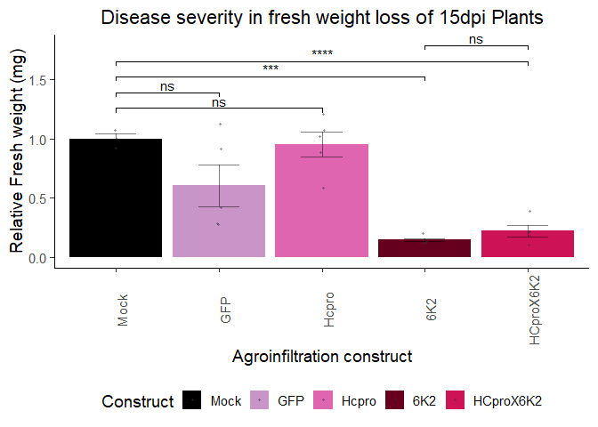

Growth & Defense trade-off in *Nicotiana benthamiana* and Turnip Mosaic
Virus interaction
================

<!-- VirusSilencing  Folder -->

# Introduction

Plant viruses occur globally and have a profound impact on plant
evolution, population structure, and agricultural practices. As obligate
biotrophs, these intracellular nanorganisms depend entirely on their
host’s survival to complete their replication cycle, propagate, and
disperse. In response, plants have evolved an array of defenses to
counteract viral infection, often leading to a trade-off between growth
and defense. This trade-off is central to plant-virus interactions, as
mounting a defense response frequently comes at the cost of reduced
growth and reproduction \[[1](#ref-karasov2017mechanisms)\].
Understanding how plants prioritize growth or defense in viral infection
context is essential to developing effective crop protection methods,
making it a pressing issue in agricultural research.

In this laboratory practice, we will investigate how variations in viral
genetics lead to a differential impact on plant growth and defense
trade-off using the compatible *Nicotiana benthamiana* / *Turnip Mosaic
Virus* pathosystem.

Nicotiana benthamiana, a species susceptible to a wide range of viruses,
serves as an important model organism for research in molecular plant
sciences and genetics. The single-stranded RNA virus Turnip Mosaic Virus
(**TuMV**) is a widespread plant pathogen known to infect a broad range
of host species, causing significant agricultural losses. Today We will
infect N. benthamiana plants with two TuMV constructs: TuMV-6K2-GFP
(**6K2G**) and TuMV-ΔHCPro expressing free GFP (**ΔHCG**) to evaluate
the growth-defense trade-off. These constructs allow us to assess how
specific viral proteins influence the growth and defense balance. By
infecting individual plants with each construct and with a mix of both
constructs, we aim to determine which virus and growth effects prevail
under mixed infections. As a negative control, plants will be
infiltrated with Agrobacterium expressing free GFP to account for
agroinfiltration effects.

The two viral constructs of our growth impact contest are:

- TuMV “6K2-GFP” (6K2G) construct developed by
  \[[2](#ref-thivierge2008eukaryotic)\]

- TuMV “ΔHCPro” expressing free GFP (ΔHCG) construct developed by
  \[[3](#ref-hafren2018turnip)\]

<div style="text-align: center;">

<figure>

<figcaption style="margin-top: 10px;">
<strong>Polyprotein structure of three viral constructs of
TuMV</strong>. On top, Wild type configuration of TuMV genome. 6K2G
construct expresses an additional copy of the membrane-associated 6K2
protein with a GFP attached to its C-terminal region. HCPro deletion or
ΔHCPro construct expresses a cleavable free GFP instead of the viral
protease HC.
</figcaption>
</figure>

<a name="Polyprotein"></a>

</div>

We will then determine disease symptoms by evaluating at 15 days
post-infection the degree of GFP expression using a UV torch in plant
leaves and quantifying viral accumulation to compare these traits
between the two viral strains as well with the combinatory treatment
exploring the relationships between TuMV genetics and their growth
impact on N. benthamiana

# Results

## Relative fresh weight

``` r
# Loading Fresh Weigth Data
  TuMV_FW <- read.csv("Data/BI1293_FW_Relative.csv", sep = "\t", header = T)
  TuMV_FW$Construct <- factor(TuMV_FW$Construct, levels = c("GFP", "Hcpro","6K2", "HCproX6K2"))
  
# Average per contruct
  average_weights <- ddply(TuMV_FW, .(Construct), summarize, Avg_Weight = mean(FW.g.))  
  average_weights_control <- subset(average_weights, Construct == "GFP")
# Relative weigth to GFP average
  TuMV_FW$Relative_Weight <- TuMV_FW$FW.g. / average_weights_control$Avg_Weight
  
  colors <- c( "6K2" = "#67001F",  "HCproX6K2" = "#CE1256", "Hcpro" = "#DF65B0" , "GFP" = "#C994C7")

# Plot
  TuMV_FW_plot <- ggplot(TuMV_FW, aes(x=Construct, y=Relative_Weight,fill = Construct)) +
     geom_bar(position = position_dodge(width = 0.9), stat = 'summary' ) +
  geom_errorbar(position = position_dodge(width = 0.9),stat = 'summary', width = 0.4,alpha = 0.5) + 
  geom_jitter( stat = 'identity', shape = 16, position = position_jitterdodge(0.15), size = 0.8, alpha = 0.5, color = "grey20") +
  labs(title = "Disease severity in fresh weight loss of 21dpi Plants", y = "Relative Fresh weight (mg)", x = "Agroinfiltration construct" ) +
   scale_fill_manual(values = colors) +  theme_classic(base_size = 14) +
theme(axis.text.x = element_text(angle = 90), legend.position = "bottom", plot.title = element_text(hjust = 0.5))

# Adding signifance test
comparisons <- list(
c( "Hcpro","GFP"),
c( "Hcpro","6K2"),
c("Hcpro","HCproX6K2"))
TuMV_FW_plot_sig <-   TuMV_FW_plot +   stat_compare_means(comparisons = comparisons,  method = "t.test", label = "p.signif")
TuMV_FW_plot_sig
```

    ## No summary function supplied, defaulting to `mean_se()`
    ## No summary function supplied, defaulting to `mean_se()`

<!-- -->

``` r
ggsave(device = svg, "Results/FreshWeight_TuMV.svg", plot = TuMV_FW_plot_sig,  width=8, height=6)
```

    ## No summary function supplied, defaulting to `mean_se()`
    ## No summary function supplied, defaulting to `mean_se()`

Why is the lab called
[Sociovirology](https://www.quantamagazine.org/viruses-finally-reveal-their-complex-social-life-20240411/)
?

## GFP and Viral titers

``` r
qPCRs_raw <-  read.table( "Data/Nb_TuMV_GFP_CP_6K2.csv", sep = ",", header = T)
qPCRs_fil <- qPCRs_raw[qPCRs_raw$Cq != "N/A",] 
qPCRs_fil$Cq <- as.numeric(qPCRs_fil$Cq)
qPCRs_fil_avg <- ddply(qPCRs_fil, .(Primer, Genotype,Replicate), summarize, Avg_Ct = mean(Cq) )
qPCRs_PP2A <- qPCRs_fil_avg[qPCRs_fil_avg$Primer =="PP2A",]
qPCRs_Target <- qPCRs_fil_avg[qPCRs_fil_avg$Primer !="PP2A",]

qPCRs_DCt <- merge(x = qPCRs_PP2A , y = qPCRs_Target, by =c("Genotype","Replicate"))
qPCRs_DCt$DCt <- qPCRs_DCt$Avg_Ct.y - qPCRs_DCt$Avg_Ct.x                    

qPCRs_DCt$log2DDCt <- 2^(- qPCRs_DCt$DCt )
 TuMV_titters <- ggplot(qPCRs_DCt, aes(x = Primer.y, y = log2DDCt, fill = Genotype , group =  Genotype)) +
  #geom_boxplot(outlier.shape = NA , position=position_dodge(width=0.9), alpha = 0.9) +
     geom_bar(position = position_dodge(width = 0.9), stat = 'summary', fun.data = mean_se, alpha = 0.6) +
geom_errorbar(position = position_dodge(width = 0.9),
                stat = 'summary', fun.data = mean_se, width = 0.4) + facet_wrap(~ Primer.y , scales = "free")  + 
   ylab("Relative expression to PP2A")   +  xlab("Gene expressed") +
   geom_point(position = position_dodge(width = 0.9), alpha = 0.5, size = 0.8, color = "grey20" ) + theme_classic(base_size = 14) +
   theme(axis.text.x = element_text(angle = 90,size = 14)) 
 TuMV_titters
```

<!-- -->

# References

<div id="refs" class="references csl-bib-body">

<div id="ref-karasov2017mechanisms" class="csl-entry">

1\. Karasov TL, Chae E, Herman JJ, Bergelson J. Mechanisms to mitigate
the trade-off between growth and defense. The Plant Cell.
2017;29:666–80.

</div>

<div id="ref-thivierge2008eukaryotic" class="csl-entry">

2\. Thivierge K, Cotton S, Dufresne PJ, Mathieu I, Beauchemin C, Ide C,
et al. Eukaryotic elongation factor 1A interacts with turnip mosaic
virus RNA-dependent RNA polymerase and VPg-pro in virus-induced
vesicles. Virology. 2008;377:216–25.

</div>

<div id="ref-hafren2018turnip" class="csl-entry">

3\. Hafrén A, Üstün S, Hochmuth A, Svenning S, Johansen T, Hofius D.
Turnip mosaic virus counteracts selective autophagy of the viral
silencing suppressor HCpro. Plant physiology. 2018;176:649–62.

</div>

</div>
